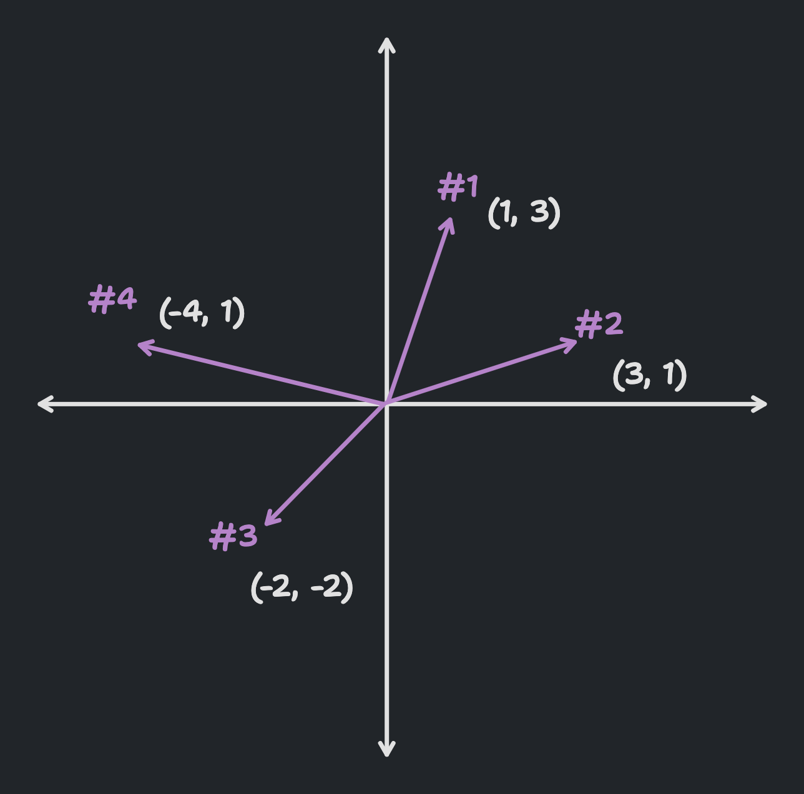
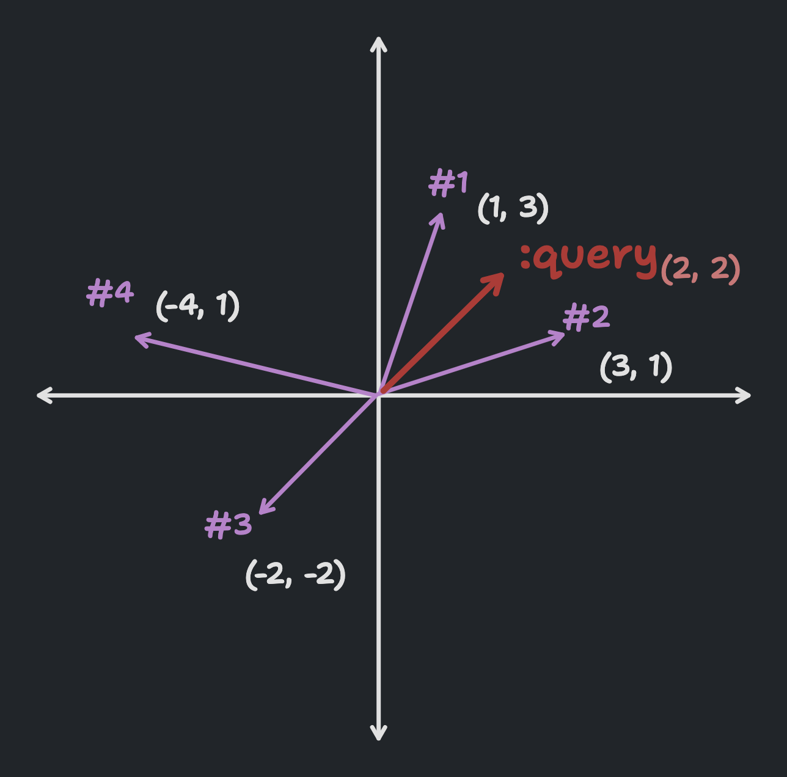
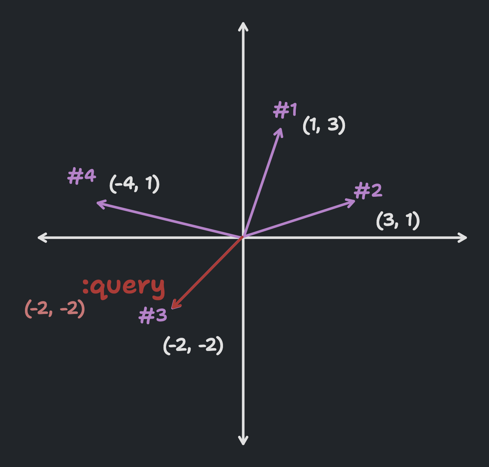

<script setup>
import { data } from './project.data.ts'
const { VERSION } = data;
</script>

# Getting Started

## Concepts

## Installing

You have several options to include `sqlite-vss` into your projects, including PyPi packages for Python, NPM packages for Node.js, Gems for Ruby, and more.

::: code-group

```bash [Python]
pip install sqlite-vss
```

```bash [Node.js]
npm install sqlite-vss
```

```js-vue [Deno]
import * as sqlite_vss from "https://deno.land/x/sqlite_vss@v{{VERSION}}/mod.ts";
```

```bash [Ruby]
gem install sqlite-vss
```

```elixir-vue [Elixir]
{:sqlite_vss, "~> {{ VERSION }}"}
```

```bash [Rust]
cargo add sqlite-vss
```

```bash [Go]
go get -u github.com/asg017/sqlite-vss/bindings/go
```

```bash [Datasette]
datasette install datasette-sqlite-vss
```

```bash [sqlite-utils]
sqlite-utils install sqlite-utils-sqlite-vss
```

:::

Alternatively, you can download pre-compiled loadable extensions from the [`sqlite-vss` Github Releases](https://github.com/asg017/sqlite-vss/releases/latest).

## Basic Example: 2-Dimensional Vectors

This example will go over the basics of `sqlite-vss`: How to create a `vss0` virtual table, how to populate it with your own vectors data, and how to query those vectors for similarity.

Say we have a list of 2-dimensional vectors with the following values:

| ID  | Vector         |
| --- | -------------- |
| 1   | `[1.0, 3.0]`   |
| 2   | `[3.0, 1.0]`   |
| 3   | `[-2.0, -2.0]` |
| 4   | `[-4.0, 1.0]`  |

Visually, these vectors would look like this:

<p align="center">  </p>

Let's store these in a `vss0` virtual table! Let's create a new virtual table called `vss_demo`, with a single vector column called `a` for these four vectors

```sqlite
create virtual table vss_demo using vss0(
  a(2)
);
```

Notice the `2` declaration in the `a` column definition. This is a required argument that tells `sqlite-vss` how many dimensions our vectors have. Also note that prefixing the virtual table name with `vss_` is a convention but not required.

Let's insert our vectors!

```sqlite
insert into vss_demo(rowid, a)
  select
    value ->> 0 as rowid,
    value ->> 1 as a
  from json_each('
    [
      [ 1, [1.0, 3.0]   ],
      [ 2, [3.0, 1.0]   ],
      [ 3, [-2.0, -2.0] ],
      [ 4, [-4.0, 1.0]  ]
    ]
  ');
```

Here we are using [SQLite's builting JSON support](https://www.sqlite.org/json1.html) to define our vector data in a JSON string. `sqlite-vss` supports vectors in a few different formats, which you [can learn more about here](api-reference#inserting-data).

<p align="center">  </p>

```sqlite

select
  rowid,
  distance
from vss_lookup
where vss_search(a, json('[2.0, 2.0]'))
limit 3;
```

```
┌───────┬──────────┐
│ rowid │ distance │
├───────┼──────────┤
│ 1     │ 2.0      │
│ 2     │ 2.0      │
│ 3     │ 32.0     │
└───────┴──────────┘
```

<p align="center">  </p>

```sqlite

select
  rowid,
  distance
from vss_lookup
where vss_search(a, json('[-2.0, -2.0]'))
limit 3;

```

```
┌───────┬──────────┐
│ rowid │ distance │
├───────┼──────────┤
│ 3     │ 0.0      │
│ 4     │ 13.0     │
│ 1     │ 34.0     │
└───────┴──────────┘
```

## Next Steps
